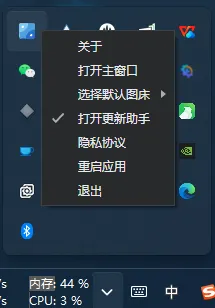

# 使用方法

## **安装**

-   **Windows**：从官网下载 Windows 版本的安装包，然后按照提示进行安装
    
    -   [PicGo下载](https://picgo.github.io/PicGo-Doc/zh/guide/#%E4%B8%8B%E8%BD%BD%E5%AE%89%E8%A3%85)
        
    -   然后按照提示进行安装。
        
-   或者通过蓝奏云下载
    
    -   [https://starryweb.lanzout.com/i2ymP2nvepub](https://starryweb.lanzout.com/i2ymP2nvepub)  
        密码:ehvi
        

## **打开**

-   双击打开，注意没用\*\*窗口\*\*直接出现要点开托盘再点picgo就行了
    

## 3\. **配置**

-   **配置环境**：如果使用的是 Windows 系统，可能需要配置环境变量，以便在命令行中直接使用 PicGo 命令。
    
-   **配置图床**：打开 PicGo 软件，在设置中选择“图床设置”，根据自己的需求选择合适的图床服务，如阿里云 OSS、腾讯云 COS、GitHub 等。但本项目的项目主有配置好的照抄就行了

### **配置：**

-   **COS版本:** v5
    
-   **设定SecretId:** AKIDUqzv\*\*\*\*\*\*\*\*\*\*\*AHHC6rRoz
    
-   **设定SecretKey:** 3ua3MRN8i\*\*\*\*\*\*\*\*\*\*\*\*8f1A8vW **（千万不要告诉别人不然可能会被DDOs攻击）**
    
-   **设定Bucket:** starryw\*\*\*\*\*\*4480062
    
-   **设定AppId:** 132\*\*\*\*0062
    
-   **设定存储区域:** ap-guangzhou
    
-   **设定存储路径**: test/
    
-   **设定自定义域名:** 不填
    
-   **设定网址后缀:** 不填
    

## 4\. **使用**

**上传图片**：可以通过多种方式上传图片，如直接将图片拖拽到 PicGo 的界面中，或者使用快捷键`Ctrl+U`（Windows）或`Command+U`（Mac）快速上传剪贴板中的图片。

-   **查看上传记录**：在 PicGo 的主界面中，可以查看已上传的图片记录，方便管理和查找。
    
-   **删除图片**：如果需要删除已上传的图片，可以在对应的图床服务中进行操作，或者使用 PicGo 提供的删除功能。
    
-   **图片压缩**：为了节省存储空间和提高上传速度，可以在 PicGo 的设置中启用图片压缩功能，并根据需要调整压缩参数。
    
-   **复制链接：**在上传区域点击**URL**然后找到相册想要复制的图片后复制就可以了
    
    .png)
    

# 优势

1.  **支持多种图床**：PicGo 支持包括但不限于 [SM.MS](http://SM.MS)、腾讯云 COS、阿里云 OSS、GitHub、七牛云等在内的多种图床服务，用户可以根据自己的需求选择合适的图床。
    
2.  **操作简便**：PicGo 的界面简洁直观，操作方便，支持拖拽和快捷键上传图片，极大地提高了用户的上传效率。
    
3.  **插件系统**：PicGo 拥有一个插件系统，允许用户安装额外的插件来扩展其功能，例如支持更多图床、添加图片压缩等。
    
4.  **跨平台**：PicGo 支持多个操作系统，包括 Windows、macOS 和 Linux，用户可以在不同的设备上使用 PicGo。
    
5.  **免费开源**：PicGo 是一款免费的开源软件，用户可以自由使用和修改其源代码。
    

# 劣势

1.  **依赖第三方存储服务**：PicGo 依赖于第三方图床服务，如果图床服务不可用，可能导致图片无法访问，影响笔记的完整性。
    
2.  **存在隐私风险**：将图片上传到第三方图床可能存在隐私泄露的风险，用户需要谨慎选择图床服务，并注意保护个人隐私。
    
3.  **离线状态下失效**：在离线状态下，PicGo 无法上传图片，笔记内容可能不完整，影响工作效率。
    
4.  **流量费用**：如果使用付费的图床服务，如腾讯云 COS、阿里云 OSS 等，可能会产生流量费用，用户需要根据自己的需求和预算选择合适的图床服务。
    
5.  **配置复杂**：对于一些新手用户来说，配置 PicGo 可能会比较复杂，需要一定的技术基础。